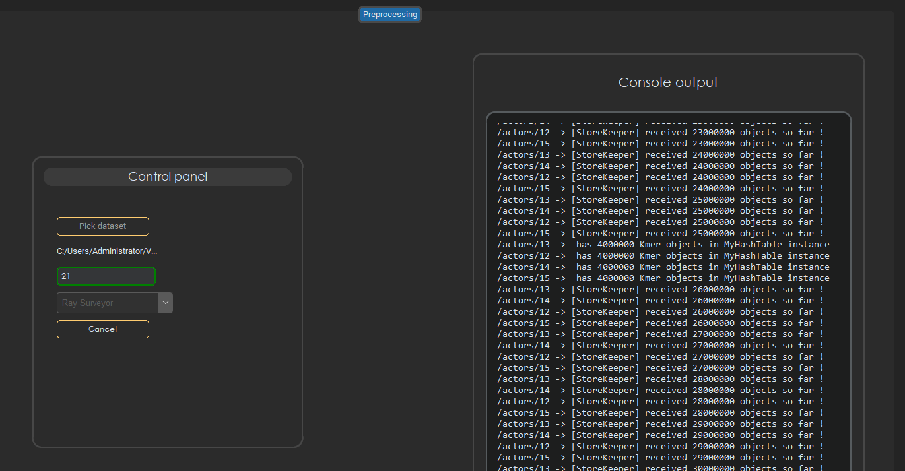

# Genomic Resistance Mapping (GRM) System Overview

## Introduction

Antimicrobial resistance (AMR) is a critical public health concern with far-reaching implications in the practice of medicine globally. Accurately predicting resistance phenotypes from genome sequences is increasingly vital in promoting the effective use of antimicrobial agents, thereby enhancing patient outcomes in bacterial infections. However, the evolving mechanisms of bacteria to combat antibiotics have led to the spread of antibiotic-resistant pathogens, challenging modern medical treatments.This integration aims to empower researchers and clinicians with accessible, efficient tools for combating AMR by accurately predicting phenotypes.

e goal of this system demonstration is to present a tool that uses machine learning algorithms to predict antimicrobial resistance from genomic data. The system provides a practical interface for the rapid assessment of resistance patterns, enabling healthcare professionals to make informed decisions about antimicrobial therapy. This tool serves as a resource for research in microbial genomics and resistance mechanisms, illustrating the potential of computational approaches in transforming AMR surveillance and management, contributing to more effective treatments for bacterial infections.

## GRM - Genomic Resistance Mapping

## Data Collection Module

This module enables the selection and retrieval of AMR datasets from PATRIC, a comprehensive bacterial genomics database. It supports filtering and accessing datasets based on phenotype count, species, and antibiotic resistance profiles.

### List Available AMR Datasets

The GRM system provides an interface for accessing a comprehensive list of AMR datasets. The system retrieves the latest datasets from a centralized database, ensuring access to up-to-date information. Datasets can be refined by applying filters such as phenotype count (≥ 50), species, and antibiotics. Relevant datasets can be downloaded directly through the interface.

### Latest Metadata for AMR

The system fetches the most recent update information for AMR datasets automatically and displays the date and time of the last update. Detailed information about dataset creation, modification, and annotations can be downloaded directly through the interface.

### Get AMR Data by Species and Antibiotics

This functionality supports detailed querying of AMR data based on specific criteria:

- **Customizable Data Retrieval**: Options to exclude intermediate values and filter data by resistance or susceptibility are provided.
- **Detailed Data Display**: Detailed information for each entry, including Genome ID, Genome Name, Phenotype, and Measurements, is displayed.
- **Data Export**: Filtered data can be exported in .tsv format.

### Downloading Genome Data

The system supports the simultaneous download of multiple genomes, enhancing efficiency. It can handle the concurrent downloading of up to 10 .fna files and provides the most recent metadata for these genomes, ensuring access to the latest data.

## Data Preprocessing Module

This module includes a control panel for dataset selection and parameter adjustments, such as k-mer size. It employs Ray Surveyor and DSK for k-mer counting and facilitates the creation of k-mer matrices for Kover training.

### Ray Surveyor

The Matrix Building tab uses Ray Surveyor to convert genomic data into k-mer matrices. This process involves counting and organizing k-mers from genomic sequences, which supports subsequent analysis tasks such as being used for ML models in Kover and other Rule Based models.

### Functionality of the Matrix Building Tab

The system accepts genomic data in various formats, including unassembled reads or assembled contigs. Ray Surveyor counts the k-mers present in the genomes, transforming raw genomic data into a structured k-mer count matrix. After k-mer counting, Ray Surveyor compiles these counts into a matrix format where each row represents a genome and each column represents a unique k-mer. The entries in the matrix are the counts of the respective k-mers in each genome.

The control panel allows adjustments of various parameters:

- **K-mer Size**: Adjusts the size of the k-mers to be counted, affecting the resolution of the genomic analysis.
- **Minimum K-mer Abundance**: Filters out k-mers that do not meet a specified occurrence threshold, reducing noise in the data.
- **CPU Utilization**: Specifies the number of CPU cores to be used by Ray Surveyor, optimizing performance based on system resources.
  The output is a comprehensive k-mer matrix in TSV format, which can be used for as input for machine learning models in the Kover module.

## Creating a Dataset in Kover Learn Module

The Kover Learn Module processes genomic data to create datasets, which can be sourced from either contigs or reads. This section outlines the key parameters involved in these processes.

### From Contigs

Creating a dataset from contigs involves processing assembled genomes, each represented by one or more fasta files. Key parameters include:

- **K-mer Size:** Determines the length of k-mers to be counted, affecting specificity and the ability to detect smaller patterns.
- **Singleton K-mers:** Includes k-mers that appear only once across all genomes, which can be useful for identifying unique features but may also introduce noise.
- **Compression Level:** Applies gzip compression settings of the HDF5 library to balance file size against CPU time for decompression. A setting of 5 is often used as a compromise between compression efficiency and performance.
- **CPU Count:** Specifies the number of CPU cores used for processing, influencing the speed and resource usage of the k-mer counting process.

### From Reads

Creating a dataset from reads involves processing unassembled genomic data, which supports handling metagenomic datasets or instances where assembly quality is low. Key parameters include:

- **K-mer Min Abundance:** Sets a threshold for the minimum occurrence of each k-mer to be included, aiding in filtering out sequencing errors or biologically irrelevant k-mers.
- **Compression Level:** Controls the compression of the dataset file, affecting storage size and data loading speed.
- **CPU Count:** Determines the number of cores dedicated to processing the reads, essential for managing large datasets and complex analyses.

### General Considerations

Both methods for creating datasets—directly from contigs and from pre-processed k-mer matrices—involve specifying an output directory. Creating datasets directly from contigs is typically faster and more straightforward within the Kover framework, allowing for quick generation of datasets ready for use in Kover's rule-based learning algorithms.

Alternatively, preparing a k-mer matrix database in advance, while potentially more time-consuming initially, provides benefits such as reusability across different machine learning platforms and analyses, extending beyond Kover's applications.

## Splitting a Dataset in Kover Learn Module

The Kover Learn Module provides functionality to split a dataset into a training set, a testing set, and optionally, cross-validation folds. Splitting the dataset is essential for evaluating the performance of models trained using Kover. The training set is used to learn the models, while the testing set is used to assess their accuracy. This process helps in preventing overfitting and ensures that the models generalize well to new data.

*Figure: The Split Dataset interface in the Kover Learn Module.*

## Viewing a Dataset in Kover Learn Module

The ability to view detailed information about a dataset supports verifying its correctness and completeness. This functionality provides transparency, assists in troubleshooting, and validates dataset parameters, supporting informed decision-making in subsequent analyses.

### View Dataset Features

The View Dataset functionality enables users to access a wide range of information about the dataset, which supports understanding and management:

- **Genome Count and IDs:** Displays the total number of genomes and their identifiers.
- **K-mer Information:** Shows the length and total count of k-mers.
- **Phenotype Details:** Provides descriptions, metadata sources, and phenotype tags.
- **Dataset Splits:** Lists available splits of the dataset, useful for planning model training and testing.
- **Compression and Classification Type:** Details the dataset's compression level and classification type.

!

## Discussion

The Genomic Resistance Mapping (GRM) system tackles the complexities of antimicrobial resistance (AMR) through an integrated approach that combines rule-based machine learning models with comprehensive data management tools. The system's architecture, which interacts with the PATRIC database, provides users with access to up-to-date genomic data necessary for the accuracy of AMR prediction models.

The GRM system includes the Set Covering Machine (SCM) and Classification and Regression Trees (CART) within its Kover Learn Module. These models are designed for high interpretability and adaptability to various types of genomic data. SCM forms models based on sets of rules derived from the presence or absence of k-mers, aiding in the identification of genetic markers linked to antibiotic resistance. CART handles both classification and regression tasks, suitable for analyses where the relationships between genomic features and phenotypes are intricate.

The system's data preprocessing and visualization capabilities support the analytical process. The preprocessing module accommodates various k-mer sizes and manages large datasets with tools like Ray Surveyor for k-mer counting. These features ensure that the data input into the machine learning models is of high quality and reflects true biological complexity.

## Conclusion

The GRM system is designed to address the challenges of AMR research. By integrating advanced data analysis tools within a user-centered design, GRM enables researchers to conduct detailed genomic analyses efficiently. The system's modular design, which includes data collection, preprocessing, and visualization, offers researchers the flexibility to customize their analyses.

In conclusion, the GRM system is a tool in the field of bioinformatics, designed to address the challenges posed by antibiotic resistance. It integrates detailed, interpretable models and the capacity to  manage vast amounts of genomic data, making it a valuable resource for researchers. The GUI simplifies access to a suite of AMR tools, enabling bioinformaticians to conduct analyses more conveniently in a single integrated platform. As the threat of AMR continues, the GRM system supports the ability to analyze and respond to resistance patterns.
